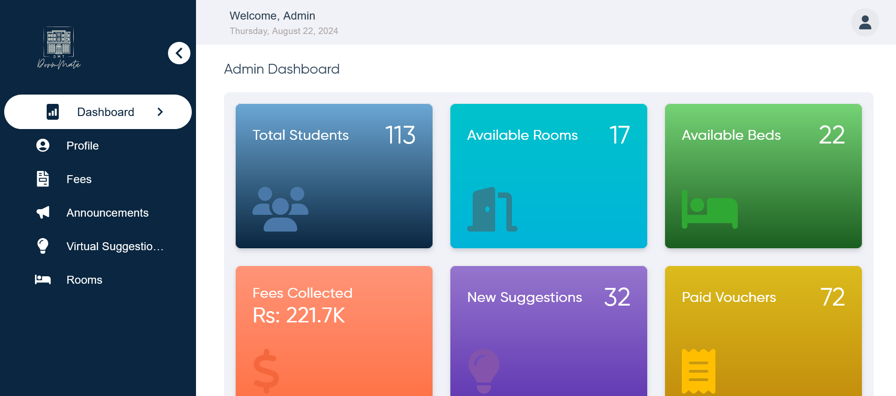
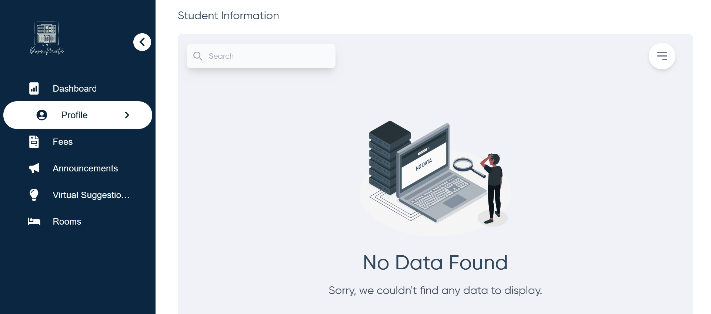
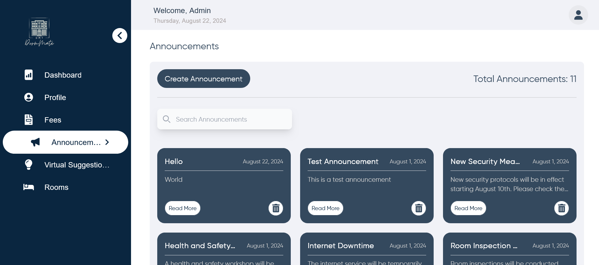
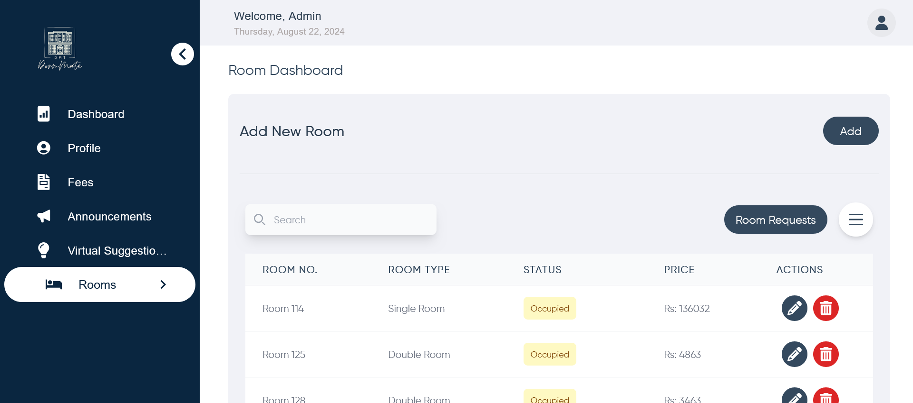

# DormMate Hostel Management System

Welcome to the **DormMate Hostel Management System**! This project is designed to manage hostel rooms and students, allowing administrators to create, update, and delete rooms, as well as manage student assignments to those rooms. This system also handles fee management and announcements, providing a complete solution for hostel management.

 <!-- Add your image link here -->

## Features

- **Authentication**: Secure login for both students and admins, with role-based access.
- **Room Management**: Admins can create, update, delete, and manage rooms, including assigning students to rooms and handling room change requests.
- **Student Management**: Manage student profiles, including viewing, updating, and handling room assignments.
- **Fee Management**: Create, update, and manage fee vouchers, including tracking payments.
- **Announcements**: Admins can create and manage announcements visible to students.
- **Responsive UI**: User-friendly interface with responsive design for different devices.
- **Redux State Management**: Leveraged Redux for global state management across the application, ensuring seamless data flow and consistency.

 <!-- Add your image link here -->

## Tech Stack

### Frontend

- **React.js**: Built with React, offering a component-based architecture for efficient UI development.
- **Redux Toolkit**: Used for state management, providing a centralized store and async handling using `createAsyncThunk`.
- **Material-UI**: Implemented Material-UI for a modern, responsive, and accessible design.
- **React Router**: Managed navigation and routing within the application.

### Backend

- **Node.js & Express.js**: The server is built using Node.js and Express.js, offering a robust and scalable backend solution.
- **MongoDB**: Used MongoDB as the primary database for storing room, student, and fee data.
- **Mongoose**: Leveraged Mongoose for elegant MongoDB object modeling in Node.js.
- **JWT Authentication**: Secure authentication using JSON Web Tokens (JWT) for both students and admins.

### APIs

- **RESTful APIs**: Designed a set of RESTful APIs to handle CRUD operations for rooms, students, and fees, ensuring a clear and maintainable backend structure.
- **Swagger Documentation**: All APIs are documented using Swagger, allowing for easy testing and integration.

 <!-- Add your image link here -->

## Installation and Setup

### Prerequisites

- **Node.js**: Ensure Node.js is installed on your system.
- **MongoDB**: A running MongoDB instance is required.
- **Docker** (optional): For containerized deployment.

### Steps to Run the Project

1. **Clone the Repository**:

   ```bash
   git clone https://github.com/hamz-aa/DormMate-Hostel-Management.git
   cd DormMate-Hostel-Management
   ```

2. **Install Dependencies**:

   - Backend:
     ```bash
     cd server
     npm install
     ```
   - Frontend:
     ```bash
     cd client
     npm install
     ```

3. **Environment Variables**:

   - Create a `.env` file in the `backend` directory with the following:
     ```plaintext
     MONGO_URI=your-mongodb-uri
     JWT_SECRET=your-jwt-secret
     ```
   - Create an optional `.env` file in the `frontend` directory with the following:
     ```plaintext
     REACT_APP_API_URL=http://localhost:8000/api
     ```

4. **Run the Backend**:

   ```bash
   cd server
   npm run dev
   ```

5. **Run the Frontend**:

   ```bash
   cd client
   npm run dev
   ```

6. **Access the Application**:
   - Open your browser and navigate to `http://localhost:{PORT}`.

 <!-- Add your image link here -->

## Future Enhancements

- **Automated Testing**: Implement unit and integration tests to ensure code reliability.
- **Role Management**: Enhance the role management system to allow for more granular permissions.
- **Notification System**: Implement an in-app and email notification system for important updates.

 <!-- Add your image link here -->

## Contributing

Contributions are welcome! Please feel free to submit a pull request or open an issue to discuss any changes.

<!-- ## License

This project is licensed under the MIT License - see the [LICENSE](LICENSE) file for details.

--- -->

Thank you for checking out our project! We hope it serves as a robust foundation for managing rooms and students efficiently. Feel free to reach out for any questions or feedback.
